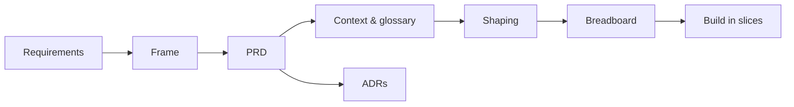

# Simple Kanban

A small, API-first kanban board built as a [Shape Up](https://basecamp.com/shapeup) project —
view, create, edit, delete, and drag-to-move stories across columns, behind a clean REST API with
an agent-driven task-tracking layer on top. It runs live at
[simple-kanban-jian.fly.dev](https://simple-kanban-jian.fly.dev).

This site is the project's documentation: the decision records that explain *why* the system is
shaped the way it is, the Shape Up planning chain behind each milestone, and the hands-on guides for
running and extending it.

## Start here

- **New to the project?** Read the [context and glossary](CONTEXT.md) for the domain model and the
  exact terms used everywhere else, then skim the [architecture decisions](adr/0001-tech-stack-and-monorepo.md).
- **Running or extending it?** The [developer workflows](DEVELOPER-WORKFLOWS.md) and the
  [guides](guides/agent-onboarding.md) cover the day-to-day loop.
- **Driving the board from an agent?** Start with [agent onboarding](guides/agent-onboarding.md).

## How the docs fit together

This is a Shape Up project, and the docs are a deliberate chain rather than scratch notes. Each
document feeds the next:

- **[Shape Up chain](REQS.md)** — the raw ask (`REQS`), narrowed to a `FRAME`, written up as a
  `PRD`, grounded in a shared `CONTEXT`, then shaped into a solution (`SHAPING`) and wired as a
  `BREADBOARD` of UI places before any code is built.
- **[Architecture decisions](adr/0001-tech-stack-and-monorepo.md)** — numbered ADRs capturing each
  load-bearing choice, its alternatives, and the trade-off, from the tech stack (0001) through
  board authorization (0013) and MCP board-scoping (0015).
- **Milestones** — the core board plus [Milestone 2](milestone-2/SLICES.md) (agent task tracking:
  epics, API versioning, a query API, token auth, and an MCP server) and
  [Milestone 3](milestone-3/SLICES.md) (accounts, multi-board with ownership, board authorization,
  and self-serve agent tokens), each planned with its own frame → shaping → breadboard → slices.
- **[Guides](guides/agent-onboarding.md)** — practical setup: onboarding an agent, wiring GitHub
  PR auto-sync, and running the end-to-end tests behind auth.

!!! note "The code is the source of truth"

    These docs describe intent. Where a documented detail and the source disagree, the source wins —
    check the repository at
    [github.com/leejianrong/simple-kanban](https://github.com/leejianrong/simple-kanban).
