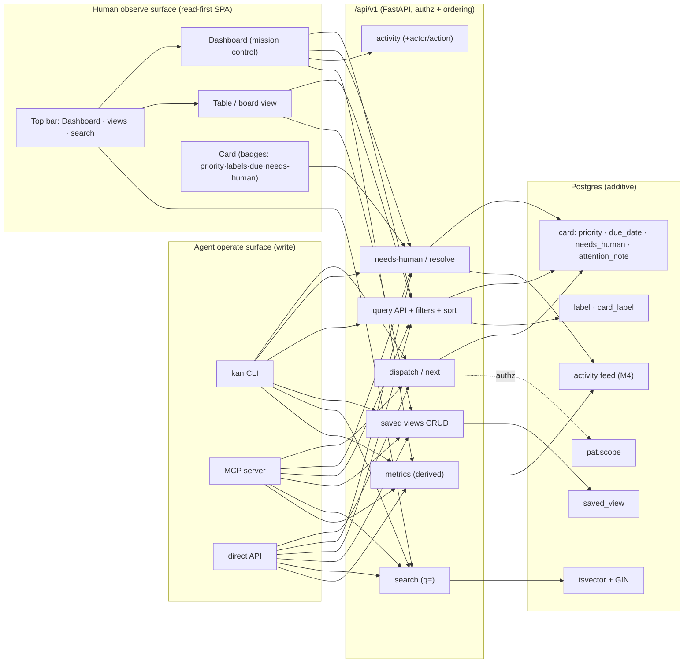

# Milestone 5 — Breadboard (Shape A)

The concrete affordances of [Shape A](SHAPING.md), grouped by the two surfaces the milestone is
organised around: the **agent operate surface** (write —
API/MCP/CLI) and the **human observe surface** (read — the SPA). The tables are the source of truth;
the wiring diagram renders them.

## UI affordances (human read/awareness surface)

| Affordance | Place | Wires out |
|---|---|---|
| **Dashboard** nav entry | Top bar (beside Board / Epics / Activity) | → Dashboard view |
| In-flight-by-assignee panel | Dashboard | → `GET /cards?column=in_progress` + work-links / auto-sync PR·CI status |
| Needs-attention list | Dashboard | → `GET /cards?needs_human=true`; row → Card detail |
| Deepened activity feed (actor / action filters) | Dashboard, Activity | → `GET /boards/{id}/activity?actor=&action=` |
| Metrics cards + charts | Dashboard | → `GET /boards/{id}/metrics` |
| Table / list view (sortable) | Board area (view toggle) | → query API |
| Saved-view switcher | Top bar / view area | → `GET/POST/DELETE /boards/{id}/views` |
| Search box | Top bar | → `GET /cards?q=` |
| Priority badge · label chips · due/overdue pill | Card | display; edits via API/CLI (+ the create/edit form selectors — the retained UI-edit path) |
| Needs-human badge | Card / Column | → `needs_human` |

## Non-UI affordances (agent operate surface + data)

| Affordance | Kind | Wires out |
|---|---|---|
| `card.priority` (varchar+CHECK), `card.due_date` (timestamptz) | column · migration | — |
| `label` (board_id, name, color) · `card_label` M:N | tables · migration | — |
| `card.needs_human` (bool), `card.attention_note` (text) | column · migration | activity |
| `personal_access_token.scope` (read/write) | column · migration | authz |
| `saved_view` (board_id, name, query JSON) | table · migration | — |
| `card` FTS `tsvector` + GIN index | migration | search |
| `POST /boards/{id}/dispatch` · `GET /boards/{id}/next` | endpoint | ordering + `FOR UPDATE SKIP LOCKED` |
| `POST /cards/{id}/needs-human` · `POST /cards/{id}/resolve` | endpoint | activity |
| `GET/POST/DELETE /boards/{id}/views` | endpoint | `saved_view` |
| `GET /boards/{id}/metrics` | endpoint | activity feed + card timestamps |
| Query filters `priority`/`label`/`due`/`needs_human`/`assignee`/`q` + `sort` | handler | — |
| Activity filters `actor`/`action` | handler | — |
| MCP tools + `kan` verbs for every endpoint above | adapter | `/api/v1` |

## Wiring

Slicing follows in [SLICES.md](SLICES.md).
